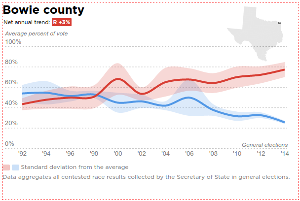

# dmn-elex-vote-history

[](https://badge.fury.io/js/dmn-elex-vote-history)

Chart module for historical county voting data.



### Install
```bash
$ npm install --save dmn-elex-vote-history
```

##### Requirements

This module uses ES6 syntax. To use as a pre-compiled module, you'll need a compiler like [babel](https://babeljs.io/).

### Use

In the client, include the `global-chart.js` bundle, which defines a global chart object, `VoteHistory`:

```html
<script src="some/path/to/global-chart.js"></script>
```

To use as a module, simply import the chart object:
```javascript
import VoteHistory from 'dmn-elex-vote-history';
```

The chart object has three methods, one to create the chart, initially, another to update it and a third to resize the chart. Update will also resize the chart when called with data.

```javascript
var myChart = new VoteHistory();

// create needs a selection string and prefectched data and geoData
myChart.create('#chart', data, geoData);

// update needs only new data
myChart.update(newData);

// resize
myChart.resize();
```

To apply this chart's default styles when using SCSS, simply define the variable `$VoteHistory-container` to represent the ID or class of the chart's container(s) and import the `_chart-styles.scss` partial.

```CSS
$VoteHistory-container: '#chart';

@import 'path/to/dmn-elex-vote-history/src/scss/_chart-styles';
```


### Developing

Write your chart code in `chart.js` and add custom styles to `_chart-styles.scss`.

Then, just run gulp:
```bash
$ gulp
```

Or to minimize javascript before publishing:
```bash
$ gulp --production
```
